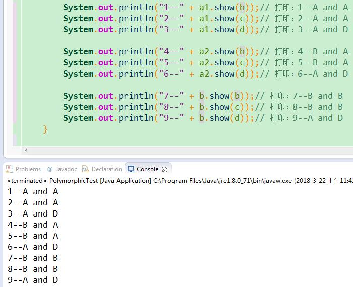

## 摘要：
将实例化对象的引用赋值给超类变量，超类变量引用的是被子类重写的方法，或者

将实例化对象的引用赋值给接口变量，接口变量引用的是被实现类重写的方法

否则，按照继承关系的优先级调用方法：

```
this.method(o)<----super.method(o)<----this.method((super)o)<----super.method((super)o)
```


## 例子演示多态的特性

```java
public class PolymorphicTest {

	/**
	 * @param args
	 */
	public static void main(String[] args) {
		// TODO Auto-generated method stub
		A a1 = new A();
		A a2 = new B();
		B b = new B();
		C c = new C();
		D d = new D();

		System.out.println("1--" + a1.show(b));// 打印：1--A and A
		System.out.println("2--" + a1.show(c));// 打印：2--A and A
		System.out.println("3--" + a1.show(d));// 打印：3--A and D

		System.out.println("4--" + a2.show(b));// 打印：4--B and A
		System.out.println("5--" + a2.show(c));// 打印：5--B and A
		System.out.println("6--" + a2.show(d));// 打印：6--A and D

		System.out.println("7--" + b.show(b));// 打印：7--B and B
		System.out.println("8--" + b.show(c));// 打印：8--B and B
		System.out.println("9--" + b.show(d));// 打印：9--A and D
	}

	static class A {
		public String show(D obj) {
			return ("A and D");
		}

		public String show(A obj) {
			return ("A and A");
		}
	}

	static class B extends A {
		public String show(B obj) {
			return ("B and B");
		}

		public String show(A obj) {
			return ("B and A");
		}
	}

	static class C extends B {

	}

	static class D extends B {

	}

}
```




- 分析`A a1 = new A()`

`a1.show(b)`

先在A类中查找是否存在`show(b)`方法，即this.show(b)，不存在

然后在A类的超类中查找是否存在`show(b)`，A的超类是Object，不存在

再将传入参数上溯造型查找是否存在，参数b的超类是A，即`this.show((A)b)`，发现了`show(a)`方法

因为a1持有的是A类的引用，所以，最终打印：`1--A and A`


`a1.show(c)`

先在A类中查找是否存在`show(c)`方法，不存在

然后在A类的超类中查找是否存在`show(c)`，A的超类是Object，不存在

再将传入参数上溯造型查找是否存在，即`this.show((B)c)`，不存在

继续将传入参数上溯造型查找是否存在，即`this.show((A)c)`，发现了`show(a)`方法

因为a1持有的是A类的引用，所以，最终打印：`2--A and A`

*Note that：上溯造型的对象依次是当前对象的超类、祖先类*


`a1.show(d)`

先在A类中查找是否存在`show(d)`方法，发现了该方法

因为a1持有的是A类的引用，所以，最终打印：`3--A and D`


- 分析`A a2 = new B()`

`a2.show(b)`

先在A类中查找是否存在`show(b)`方法，不存在

然后在A类的超类中查找是否存在`show(b)`方法，不存在

再将参数上溯造型查找是否存在，即`this.show((A)b)`，发现了`show(a)`方法

因为a2持有的是B类的引用，进一步检查子类（即B类）是否重写了`show(a)`方法，发现重写了

所以，最终打印：`4--B and A`


`a2.show(c)`

先在A类中查找是否存在`show(c)`，不存在

然后在A类的超类(即Object)中查找是否存在`show(c)`方法，不存在

再将参数上溯造型查找是否存在(*上溯造型的对象依次是当前对象的超类、祖先类*)，即`this.show((B)c)`，不存在

继续将参数上溯造型查找是否存在，即`this.show((A)c)`，发现了`show(a)`方法

因为a2持有的是B类的引用，进一步检查子类（即B类）是否重写了`show(a)`方法，发现重写了

所以，最终打印：`5--B and A`


`a2.show(d)`

先在A类中查找是否存在`show(d)`方法，发现了该方法

因为a2持有的是B类的引用，检查子类（即B类）是否重写了`show(d)`方法，没有重写

所以，最终打印：`6--A and D`


- 分析`B b = new B()`

`b.show(b)`

先在B类中查找是否存在`show(b)`方法，发现了`show(b)`方法

因为b持有的是B类的引用，所以不用考虑重写的问题，最终打印：`7--B and B`


`b.show(c)`

先在B类中查找是否存在`show(c)`方法，不存在

然后在B类的超类（即A类）中查找是否存在该方法，即`A.show(c)`，不存在

再将参数上溯造型（造型的对象是B类、A类、Object类），即`show((B)c)`，发现了`show(b)`方法

因为b持有的是B类的引用，所以不用考虑重写的问题，最终打印：`8--B and B`


`b.show(d)`

先在B类中查找是否存在`show(d)`方法，不存在

然后在B类的超类（即A类）中查找是否存在该方法，即`A.show(d)`，发现了该方法

因为b变量持有的是B类的引用，所以不用考虑重写的问题，最终打印：`9--A and D`